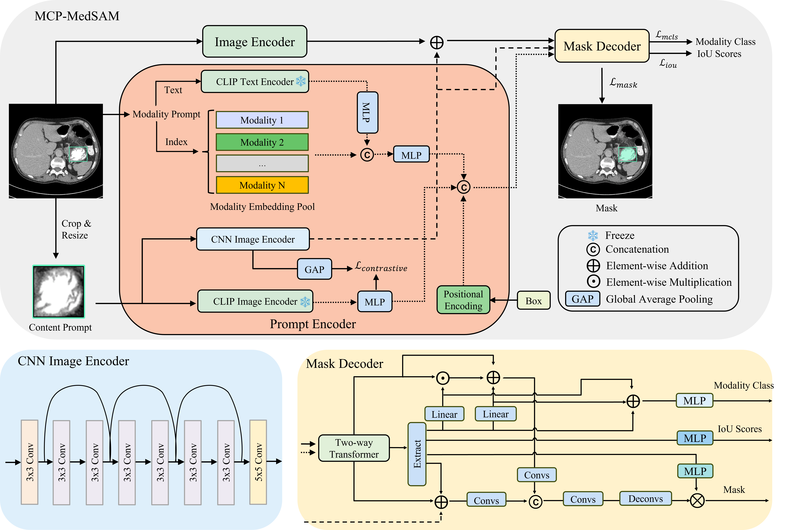

# MCP-MedSAM

Pytorch Implementation of the paper:
"[MCP-MedSAM: A Powerful Lightweight Medical Segment Anything Model Trained with a Single GPU in Just One Day](https://arxiv.org/abs/2412.05888)"



## 📄 Overview

This work proposes a lightweight variant of MedSAM by integrating:

- A **pre-trained Tiny ViT** as the vision backbone  
- Two novel prompt types:  
  - **Modality Prompt**  
  - **Content Prompt**  
- A **modified mask decoder** adapted to these prompts  

To further improve performance across imaging modalities, we introduce a **modality-aware data sampling strategy** that ensures better balance and generalization.

With these enhancements, our model achieves strong multi-modality segmentation performance, and can be trained in approximately **1 day on a single A100 (40GB)** GPU.

<!-- 
We are currently releasing the inference code along with the model weight. You can download from [here](https://drive.google.com/drive/folders/1NW4aSNhk-dtiK-dicTAUp0g0eR2fryNi?usp=sharing).

The training code has been released and you can train your . -->

## Requirements

* Python==3.10.14
* torch==2.0.0
* torchvision==0.15.0
* transformers==4.49.0

## Training and Inference

Training and inference can be done by running train.py and infer.py. Additionally, we also release the model weight for inference, which can be downloaded from [here](https://drive.google.com/drive/folders/1NW4aSNhk-dtiK-dicTAUp0g0eR2fryNi?usp=sharing). Furthermore, MCP-MedSAM has also been uploaded to the [huggingface](https://huggingface.co/Leo-Lyu/MCP-MedSAM), including pre-trained weights as well.

## Citation

```bash
@article{lyu2024mcp,
  title={MCP-MedSAM: A Powerful Lightweight Medical Segment Anything Model Trained with a Single GPU in Just One Day},
  author={Lyu, Donghang and Gao, Ruochen and Staring, Marius},
  journal={arXiv preprint arXiv:2412.05888},
  year={2024}
}
```
